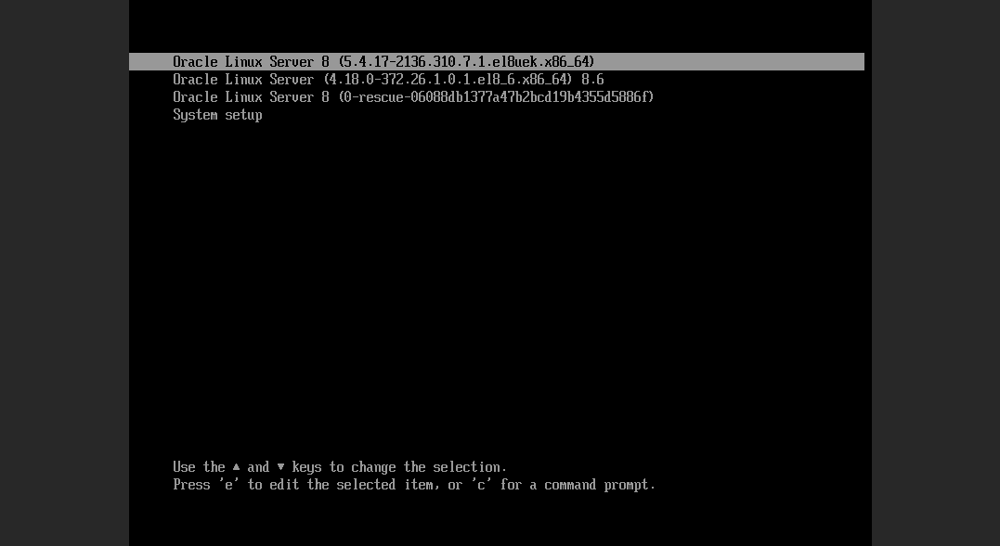

## 1 Исправленное.
Интерефейсы докера будут обычно называются по-другому да и айпишники у них имеют вид - 172.17.х.х обычно.
На счёт впна вопрос. VPN это протоколы тунелирования, они же могут имет выход в интернет. Почему я не должен был его вывести, если бы такой был?
```
[root@dev ~]# ip route get 1.1.1.1
1.1.1.1 via 188.227.32.1 dev enp0s5 src 188.227.32.87 uid 0
    cache
[root@dev ~]# curl ifconfig.me
188.227.32.87
```
## 2.
```
[root@dev home]# mkfifo pipe1
[root@dev home]# ls
pipe1
[root@dev home]# ss -plnt > pipe1 &
[1] 66187
[root@dev home]# cat pipe1 > output.txt
[1]+  Done                    ss -plnt > pipe1
[root@dev home]# cat output.txt
State  Recv-Q Send-Q Local Address:Port Peer Address:PortProcess
LISTEN 0      128          0.0.0.0:22        0.0.0.0:*    users:(("sshd",pid=1122,fd=5))
```
## 3.
```
[root@dev home]# tar -cvf output.tar -T pipe1 &
[1] 66253
[root@dev home]# jobs
[1]+  Running                 tar -cvf output.tar -T pipe1 &
[root@dev home]# echo "/var/log/messages" > pipe1
[root@dev home]# tar -tvf output.tar
-rw------- root/root     14664 2024-11-25 15:28 var/log/messages
```
## 4.
```
[root@dev home]# cat pipe1 | xargs -I {} date "+{}" &
[1] 66492
[root@dev home]# echo "%s" > pipe1
[root@dev home]# 1732552205
```
## 5.
```
[root@dev home]# cat < pipe1 > output.txt &
[1] 66668
[root@dev home]# cat <<EOF > pipe1
> asdasdasdasd 1
> asdasdasdasdsa 2
> EOF
[1]+  Done                    cat < pipe1 > output.txt
[root@dev home]# cat output.txt
asdasdasdasd 1
asdasdasdasdsa 2
```
## Bonus.
Я не знаю как сюда прикреплят результаты работы по этому заданию, поэтому опишу и постараюсь оставить хоть какие-то скрины.
Ещё не очень понятно по заданию, что нужно сделать: верунть систему к начальному виду или просто запустить.
Для запуска достаточно выбрать другое ядро в меню GRUB.

Для востановления системы можно просто переименовать или вернуть на место ядро. 
Можно использовать бекапы или снепшоты(сервис это позволяет вроде бы).
Можно переустановить ядро с помощью команды:
```
sudo yum reinstall kernel
```
Также в конфиге GRUB можно поменять название ядра.
